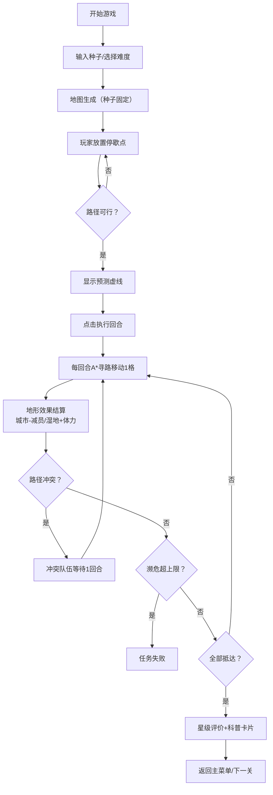

## 1. 产品概述

《鹤舞归途》是一款面向青少年科普教育的网格策略拼图游戏，通过互动式游戏体验让玩家理解黑颈鹤迁徙廊道的重要性。玩家在随机生成的地图上放置临时停歇点，引导三支鹤群队伍从繁殖地安全抵达越冬地，过程中需避开城市噪声区、利用湿地恢复体力，同时协调多队伍路径避免冲突。

- **核心目标**：科普黑颈鹤迁徙生态学知识，理解廊道保护的必要性
- **目标用户**：10-16岁青少年学生、科研组科普活动参与者
- **教学价值**：种子复现机制便于课堂教学，科普卡片奖励系统强化知识点记忆

## 2. 核心功能

### 2.1 用户角色
| 角色 | 使用场景 | 核心权限 |
|------|----------|----------|
| 学生玩家 | 个人学习、课堂游戏 | 游玩关卡、收集科普卡片 |
| 教师/科研人员 | 课堂教学演示 | 使用种子生成指定地图、复现教学案例 |

### 2.2 功能模块
1. **主菜单**：关卡选择、种子输入、难度选择、科普图鉴
2. **游戏地图**：16×12网格地图、地形渲染、预测路径可视化
3. **队伍管理**：三支鹤群状态显示、濒危亚种特殊规则
4. **停歇点系统**：放置/撤销停歇点、保护级别限制数量
5. **回合系统**：步进行走、A*自动寻路、冲突检测
6. **结算系统**：通关评价、科普卡片奖励、成绩统计

### 2.3 页面详情
| 页面名称 | 模块名称 | 功能描述 |
|----------|----------|----------|
| 主菜单 | 关卡入口 | 种子输入框、难度选择（初级/中级/高级）、开始游戏 |
| 主菜单 | 科普图鉴 | 已收集卡片展示、黑颈鹤知识百科 |
| 游戏页 | 地图区域 | 16×12网格、地形色块、鹤群动画、预测路径虚线 |
| 游戏页 | 左侧队伍栏 | 三支队伍信息：种群类型、数量、体力、减员上限 |
| 游戏页 | 右侧控制面板 | 停歇点库存、放置/撤销按钮、执行回合、重置关卡 |
| 游戏页 | 顶部状态栏 | 当前回合数、剩余步数、种子编号、暂停菜单 |
| 结算弹窗 | 成绩展示 | 存活数量、用时步数、星级评价、获得卡片 |

## 3. 核心流程

玩家选择难度并输入种子→系统生成固定地图→玩家放置有限停歇点→系统实时显示预测路径虚线→点击执行回合→鹤群每步沿A*最短路径移动→途经城市减员、湿地恢复体力→冲突检测（多队伍不可同格）→濒危亚种减员上限更严→所有队伍抵达越冬地结算→展示科普卡片。

## 4. 用户界面设计

### 4.1 设计风格
- **主色调**：湿地蓝绿系（#2D6A4F深绿、#40916C中绿、#74C69D浅绿、#B7E4C7超浅绿）搭配迁徙橙（#E76F51警示橙、#F4A261暖橙）
- **辅助色**：山脉灰褐（#6C584C）、城市深紫（#5A189A带噪点纹理）、湿地蓝（#48CAE4波光动画）
- **按钮风格**：圆角12px、轻微渐变、hover微上浮+阴影、active下陷
- **字体**：标题用"ZCOOL KuaiLe"童趣手写体，正文用"Noto Sans SC"黑体
- **布局**：三栏式（左队伍+中地图+右控制），卡片化设计，地形用emoji+色块双编码
- **动效**：鹤群每步用CSS帧动画扑翼，预测路径虚线流动动画，卡片翻转动画

### 4.2 页面设计概览
| 页面名称 | 模块名称 | UI元素 |
|----------|----------|--------|
| 主菜单 | 关卡入口 | 大标题手写体、种子输入框带随机按钮、难度卡片（绿/黄/红边框） |
| 游戏页 | 地图区域 | 16×12 CSS Grid网格、每格56px、地形色块+emoji叠加、虚线SVG路径层 |
| 游戏页 | 队伍栏 | 头像卡片（鹤emoji+种群色边框）、血量进度条、减员警告闪烁 |
| 游戏页 | 控制面板 | 停歇点圆形图标（带剩余数量角标）、大按钮"开始迁徙"、撤销按钮 |
| 结算弹窗 | 成绩展示 | 星级评分（3星满）、卡片翻转展示、知识详情手风琴 |

### 4.3 响应式
- 桌面优先（≥1280px）：完整三栏布局
- 平板（768-1279px）：队伍栏折叠为顶部横向卡片，控制栏移至底部
- 手机（<768px）：网格缩至42px/格，竖屏堆叠布局，触摸优化

### 4.4 动效设计要点
- 鹤群移动：每格0.4s，路径间线性插值，翅膀用keyframes上下扇动
- 预测路径：stroke-dasharray + stroke-dashoffset 循环流动，透明度0.6
- 城市伤害：格子红色脉冲+鹤群抖动动画
- 湿地恢复：水波纹扩散+绿色粒子上升
- 卡片获取：3D翻转动画（rotateY），稀有度越高光效越强
