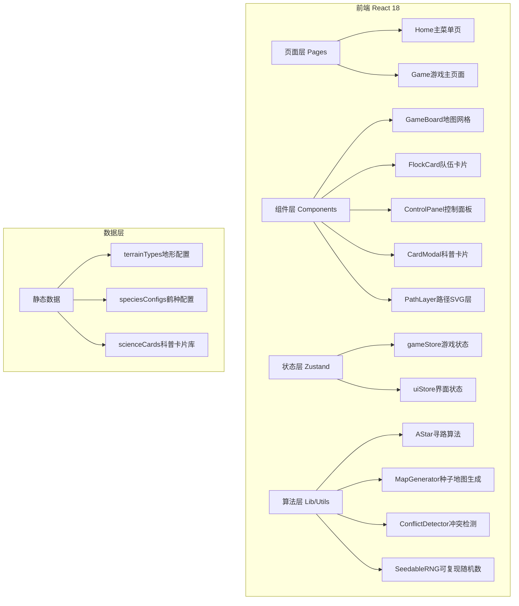

## 1. 架构设计



## 2. 技术描述

- **前端框架**：React@18 + TypeScript@5 + Vite@6
- **样式方案**：TailwindCSS@3 + CSS Modules（局部动画）
- **状态管理**：Zustand@5（游戏状态+UI状态分离）
- **图标库**：lucide-react（系统图标）+ Emoji（游戏内元素）
- **后端**：纯前端项目，无后端需求
- **数据持久化**：LocalStorage存储已收集卡片和最高分

## 3. 路由定义

| 路由 | 用途 |
|------|------|
| / | 主菜单：关卡选择、种子输入、图鉴入口 |
| /game | 游戏主页面：地图、队伍、控制面板 |

## 4. 数据模型

### 4.1 TypeScript 核心类型定义

```typescript
// 地形类型
type TerrainType = 'grass' | 'wetland' | 'mountain' | 'city' | 'breeding' | 'wintering';

// 地图格子
interface Cell {
  x: number;
  y: number;
  terrain: TerrainType;
  hasRestStop: boolean;  // 是否有停歇点
  restStopId?: string;
}

// 鹤种群类型
type SpeciesGrade = 'common' | 'secondary' | 'endangered';

interface FlockConfig {
  id: string;
  name: string;          // 如：黑颈鹤指名亚种、黑颈鹤滇西亚种（濒危）
  grade: SpeciesGrade;
  emoji: string;
  color: string;         // 队伍标识色
  initialCount: number;  // 初始数量
  maxLossRatio: number;  // 最大允许减员比例
  staminaCost: number;   // 每步体力消耗
  staminaRecover: number; // 湿地恢复量
}

// 游戏中的鹤群实例
interface Flock {
  configId: string;
  position: { x: number; y: number };
  breedingPos: { x: number; y: number };
  winteringPos: { x: number; y: number };
  count: number;         // 当前存活数量
  initialCount: number;
  stamina: number;       // 0-100体力
  hasArrived: boolean;
  path: { x: number; y: number }[];  // 当前规划路径
  predictedPath: { x: number; y: number }[];  // 预测完整路径
}

// 停歇点
interface RestStop {
  id: string;
  x: number;
  y: number;
  flockId?: string;      // 专属某队伍（可选）
}

// 难度配置
interface DifficultyConfig {
  name: string;
  gridWidth: number;
  gridHeight: number;
  maxRestStops: number;  // 停歇点总数上限
  maxTurns: number;      // 最大回合数
  cityDensity: number;   // 城市密度 0-1
  mountainDensity: number;
  wetlandDensity: number;
  flocks: string[];      // 启用的鹤群配置ID
}

// 科普卡片
interface ScienceCard {
  id: string;
  title: string;
  category: 'species' | 'habitat' | 'migration' | 'threat';
  rarity: 'common' | 'rare' | 'legendary';
  content: string;
  imageEmoji: string;
  unlockCondition: string; // 解锁条件描述
}

// 游戏状态
interface GameState {
  seed: number;
  difficulty: DifficultyConfig;
  grid: Cell[][];
  flocks: Flock[];
  restStops: RestStop[];
  currentTurn: number;
  maxTurns: number;
  restStopsRemaining: number;
  phase: 'planning' | 'executing' | 'paused' | 'won' | 'lost';
  turnPhase: 'idle' | 'moving' | 'resolving';
  collectedCardIds: string[];
}
```

### 4.2 核心算法接口

```typescript
// A*寻路 - 考虑地形代价、停歇点、冲突预留
function aStar(
  start: { x: number; y: number },
  goal: { x: number; y: number },
  grid: Cell[][],
  options: {
    terrainCosts: Record<TerrainType, number>;  // 地形移动代价
    blockedCells?: Set<string>;  // 其他队伍预留位置
    flockId?: string;
  }
): { x: number; y: number }[] | null;

// 种子随机数生成器（mulberry32算法，可复现）
function createSeededRNG(seed: number): () => number;

// 地图生成
function generateMap(
  seed: number,
  config: DifficultyConfig,
  breedingPositions: { x: number; y: number }[],
  winteringPositions: { x: number; y: number }[]
): Cell[][];

// 冲突检测 - 检查下一回合多队伍是否同格
function detectConflicts(
  flocks: Flock[],
  nextPositions: Map<string, { x: number; y: number }>
): { conflictingFlockIds: string[]; resolutions: Map<string, 'wait' | 'reroute'> };

// 地形效果结算
function resolveTerrainEffects(
  flock: Flock,
  cell: Cell
): {
  countChange: number;     // 数量变化（负数=减员）
  staminaChange: number;   // 体力变化
  events: string[];        // 事件日志
};
```

## 5. 文件结构规划

```
src/
├── pages/
│   ├── Home.tsx              # 主菜单页
│   └── Game.tsx              # 游戏主页
├── components/
│   ├── game/
│   │   ├── GameBoard.tsx     # 地图网格容器
│   │   ├── GridCell.tsx      # 单个格子
│   │   ├── PathLayer.tsx     # SVG路径虚线层
│   │   ├── FlockSprite.tsx   # 鹤群精灵（带动画）
│   │   └── RestStopMarker.tsx # 停歇点标记
│   ├── ui/
│   │   ├── FlockCard.tsx     # 队伍信息卡
│   │   ├── ControlPanel.tsx  # 控制面板
│   │   ├── StatusBar.tsx     # 顶部状态栏
│   │   ├── ResultModal.tsx   # 结算弹窗
│   │   └── CardReveal.tsx    # 卡片翻转动画
│   └── menu/
│       ├── SeedInput.tsx     # 种子输入
│       ├── DifficultySelect.tsx
│       └── CodexView.tsx     # 图鉴
├── store/
│   ├── gameStore.ts          # Zustand游戏状态
│   └── uiStore.ts            # UI状态（选中、弹窗等）
├── lib/
│   ├── algorithms/
│   │   ├── aStar.ts          # A*寻路
│   │   ├── mapGenerator.ts   # 地图生成
│   │   ├── conflict.ts       # 冲突检测
│   │   └── seededRNG.ts      # 可复现随机数
│   └── gameLogic/
│       ├── turnSystem.ts     # 回合推进
│       ├── terrainEffects.ts # 地形效果
│       └── scoring.ts        # 评分系统
├── data/
│   ├── terrains.ts           # 地形配置
│   ├── species.ts            # 鹤种配置
│   ├── difficulties.ts       # 难度配置
│   └── scienceCards.ts       # 科普卡片库
├── types/
│   └── game.ts               # 所有类型定义
└── hooks/
    ├── useGameLoop.ts        # 回合执行循环
    └── usePathPrediction.ts  # 路径预测更新
```
